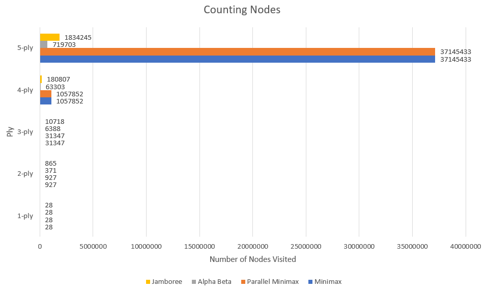
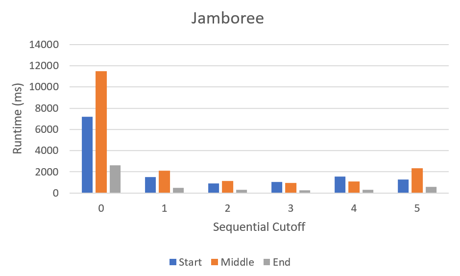
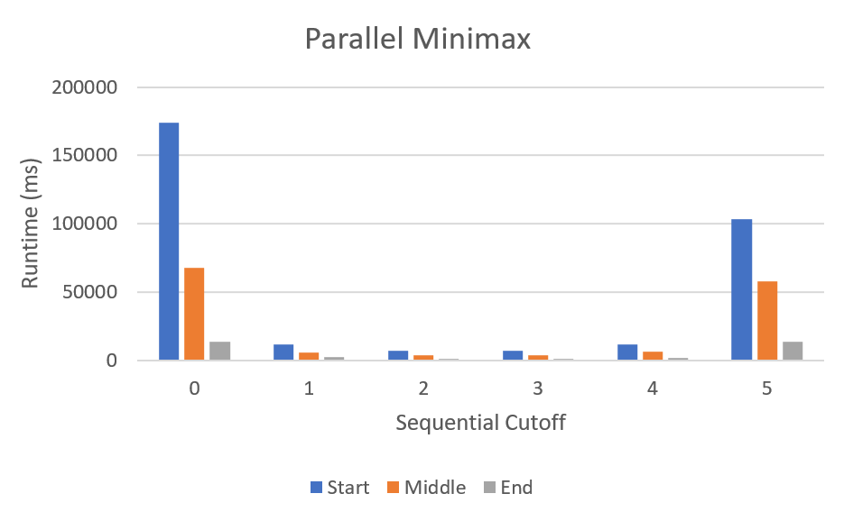
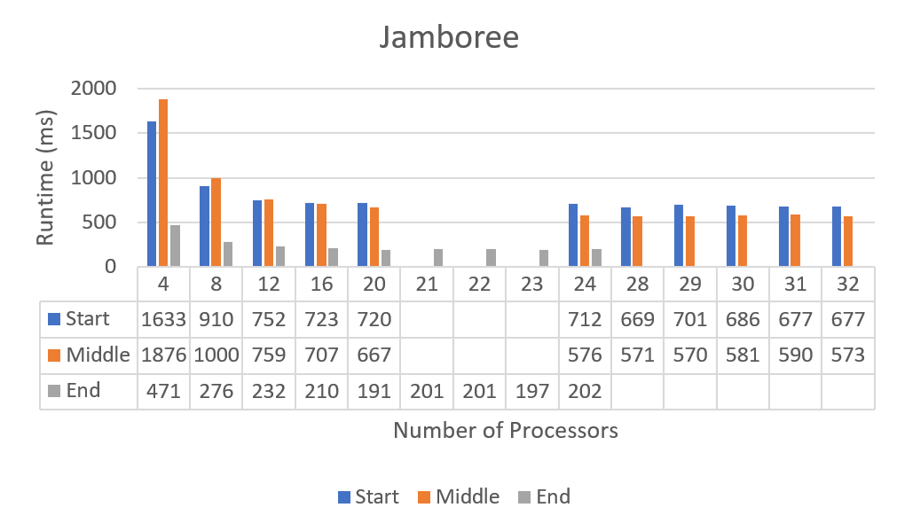
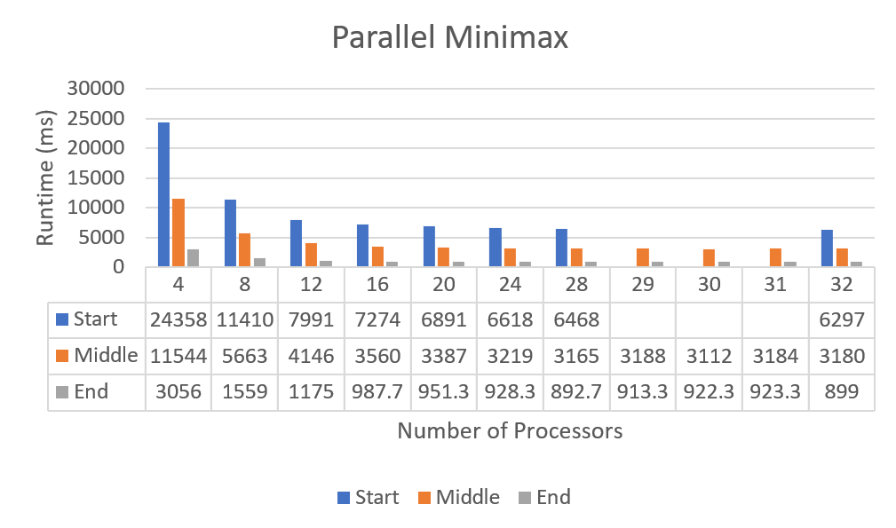
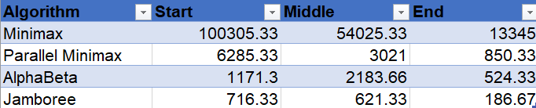
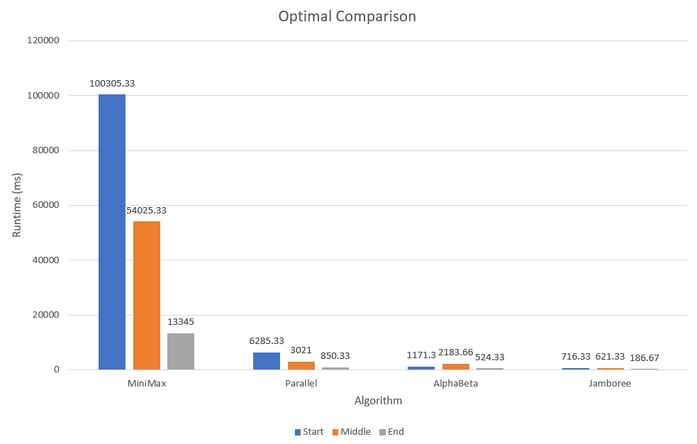

# Project 3 (Chess) Write-Up #
--------

## Project Enjoyment ##
- How Was Your Partnership?
  It was great, we worked together since project 1 and we understood our responsibilities pretty well.
  
- What was your favorite part of the project?
  Converting the sequential searchers to the parallel versions was kind of interesting, especially after
  practicing on the para excercises.

- What was your least favorite part of the project?
  The writeup, although poses really interesting questions, was confusing to understand at times.

- How could the project be improved?
  I think a more in-depth tutorial or discussion on how to use the Google Compute Engine, and how to run
  actual experiments on it for the project would be useful.

- Did you enjoy the project?
  Yes, the idea of making a chess player using a searching algorithm was really interesting, and it was cool
  to put what we have learnt into something real like chess.
    
-----

## The Chess Server ##
- When you faced Clamps, what did the code you used do?  Was it just your jamboree?  Did you do something fancier?
  
  We used the jamboree with a slight modification. We did a simpler version of the MVV-LVA and did move ordering based upon whether or not a move was a capture move.

- Did you enjoy watching your bot play on the server?  Is your bot better at chess than you are?

  I really enjoyed watching our bot play on the server as I played chess in high school and have a bit of knowledge of chess so I was able to analyze the board as well in between the moves. Our bot is definitely better at chess than I am.

- Did your bot compete with anyone else in the class?  Did you win?
  
  We did not compete with anyone in the class.

- Did you do any Above and Beyond?  Describe exactly what you implemented.
  
  We did not do any Above and Beyond.

## Experiments ##

### Chess Game ###

#### Hypotheses ####
Suppose your bot goes 3-ply deep.  How many game tree nodes do you think
it explores (we're looking for an order of magnitude) if:
 - ...you're using minimax?
    About 30,000 nodes
 - ...you're using alphabeta?
    About 10,000 nodes

#### Results ####
Run an experiment to determine the actual answers for the above.  To run
the experiment, do the following:
1. Run SimpleSearcher against AlphaBetaSearcher and capture the board
   states (fens) during the game.  To do this, you'll want to use code
   similar to the code in the testing folder.
2. Now that you have a list of fens, you can run each bot on each of them
   sequentially.  You'll want to slightly edit your algorithm to record the
   number of nodes you visit along the way.
3. Run the same experiment for 1, 2, 3, 4, and 5 ply. And with all four
   implementations (use ply/2 for the cut-off for the parallel
   implementations).  Make a pretty graph of your results (link to it from
   here) and fill in the table here as well:


|      Algorithm     | 1-ply | 2-ply | 3-ply | 4-ply |  5-ply |
| :----------------: |:-----:|:-----:|:-----:|:-----:|:------:|
|       Minimax      |   28  |  927  | 31347 |1057852|37145433|
|  Parallel Minimax  |   28  |  927  | 31347 |1057852|37145433|
|      Alphabeta     |   28  |  371  | 6388  | 63303 |719703  |
|      Jamboree      |   28  |  865  | 10718 |180807 |1834245 |



#### Conclusions ####
How close were your estimates to the actual values?  Did you find any
entry in the table surprising?  Based ONLY on this table, do you feel
like there is a substantial difference between the four algorithms?

We counted the number of nodes visited for each fen (64 fens in total),
and totaled them up. I then divided it by the number of fens to get the
average nodes, which is what is represented in the table and graph above.
Looking at minimax and alphabeta for 3-ply, I was pleasantly surprised that
my estimates were really close. The minimax and parallel minimax pair are significantly
worse from the alphabeta and jamboree pair. This is because alpha beta removes
unnecessary nodes to be visited, which is the reason for the significant difference
in number of nodes visited. It makes sense that minimax and parallel minimax
visits the same amount of nodes, as the optimization for parallel minimax is using parallelism
to reduce runtime, not reducing the number of nodes itself, unlike alphabeta and jamboree,
which is why they visited way lesser nodes than the former pair. (due to pruning).

One thing to note is that jamboree visited significantly more nodes than alpha beta (not to the extent
of the minimax and parallel minimax pair). This was interesting as jamboree was supposed to be the "ultimate"
searcher out of the four. My guess is that similar to parallel minimax, jamboree optimizes not by pruning like
alpha beta, but more because of parallelism.


### Optimizing Experiments ###
THE EXPERIMENTS IN THIS SECTION WILL TAKE A LONG TIME TO RUN. 
To make this better, you should use Google Compute Engine:
* Run multiple experiments at the same time, but **NOT ON THE SAME MACHINE**.
* Google Compute Engine lets you spin up as many instances as you want.

#### Generating A Sample Of Games ####
Because chess games are very different at the beginning, middle,
and end, you should choose the starting board, a board around the middle
of a game, and a board about 5 moves from the end of the game.  The exact boards
you choose don't matter (although, you shouldn't choose a board already in
checkmate), but they should be different.

#### Sequential Cut-Offs ####
Experimentally determine the best sequential cut-off for both of your
parallel searchers.  You should test this at depth 5.  If you want it
to go more quickly, now is a good time to figure out Google Compute
Engine.   Plot your results and discuss which cut-offs work the best on each of
your three boards.




The data we collected from 10 trials each shows that for all three board positions, Jamboree performed significantly better than Parallel Minimax. Jamboree performed the best when cutoff = 2, while Minimax performed the best when cutoff = 3.
My guess is that since Jamboree prunes and parallel minimax do not, Jamboree is more efficient and requires
a lower cutoff than parallel minimax. This makes sense as the further the cutoffs are from the middle or 2.5 the more sequential or parallel they are, which both reduce the advantage the searches can take of the parallelism.
The cutoffs also seem to affect parallel minimax on a larger scale as compared to jamboree, the difference between
the cutoff of 1 and 4 for parallel minimax being almost 100 times. This is also probably due to the pruning of jamboree,
which removes uneccessary nodes.

#### Number Of Processors ####
Now that you have found an optimal cut-off, you should find the optimal
number of processors. You MUST use Google Compute Engine for this
experiment. For the same three boards that you used in the previous 
experiment, at the same depth 5, using your optimal cut-offs, test your
algorithm on a varying number of processors.  You shouldn't need to test all 32
options; instead, do a binary search to find the best number. You can tell the 
ForkJoin framework to only use k processors by giving an argument when
constructing the pool, e.g.,
```java
ForkJoinPool POOL = new ForkJoinPool(k);
```
Plot your results and discuss which number of processors works the best on each
of the three boards.




We calculated the average runtime over 10 trials for the number of processors in increments of 4 up until the previous
speed was faster than the current. Then we incremented over the 4 core-counts in between the previous and current and found the best speed for early, middle, and end game states. From the data table, we see that the number of processors that results in the best runtime for each game state is 28, 29, 20 respectively (early, middle, end) for
Jamboree, and 32, 30, 28 for parallel minimax. This makes sense because generally the more processors that are available the more that the parallelism in the code can be taken advantaged of.
 
However, what is more important is that for all three game states, their runtimes significantly decrease until about 12 processors, where the runtime is roughly the same until 32 processors. This leads me to generalize 12 processors is the minimum number of processors for any significant decrease in runtime, any more and the decrease is insignificant and not worth it. Note that some of the data are unavailable for certain processors.

Overall, Jamboree performed significantly better than parallel minimax by a long shot. In general, as the game progresses from early
to middle to end, the runtime decreases as well, probably because the options or possible moves gets lower and lower.


#### Comparing The Algorithms ####
Now that you have found an optimal cut-off and an optimal number of processors, 
you should compare the actual run times of your four implementations. You MUST
use Google Compute Engine for this experiment (Remember: when calculating
runtimes using *timing*, the machine matters).  At depth 5, using your optimal 
cut-offs and the optimal number of processors, time all four of your algorithms
for each of the three boards.

Plot your results and discuss anything surprising about your results here.




We used the optimal cutoff and number of processors we found above over twenty trials with 3 warmup trials,
and calculated the average for start, middle and end game states. Looking at the data, for all three game
states, Jamboree performs the best, followed by Alpha beta, parallel minimax, and mini max. This is the result
of the optimization caused by pruning, and the parallelism present in the code. 
Minimax, without any optimization through parallelism or pruning, performed significantly worse than the other
three algorithms.

Alpha beta also performed better all across the game states than Parallel minimax. This leads me to believe that
pruning is more effective at optimization than parallelism in this situation, most likely because it eliminates more board states than the parallel program can speed up running all the board states. The combination of pruning and parallelism,
or the lack of both, explains why Jamboree (pruning and parallelism) performed the best, and why minimax (none) performed the worst.


### Beating Traffic ###
In the last part of the project, you made a very small modification to your bot
to solve a new problem.  We'd like you to think a bit more about the 
formalization of the traffic problem as a graph in this question.  
- To use Minimax to solve this problem, we had to represent it as a game. In
  particular, the "states" of the game were "stretches of road" and the valid
  moves were choices of other adjacent "stretches of road".  The traffic and
  distance were factored in using the evaluation function.  If you wanted to use
  Dijkstra's Algorithm to solve this problem instead of Minimax, how would you
  formulate it as a graph?
  
  	The roads between the intersections would be the edges, and the intersections themselves would be
  	the nodes. The weights of the edges will be based on what the traffic and speed limit there is.
  	the more traffic and the lower the speed limit, the bigger the value of the weight.   

- These two algorithms DO NOT optimize for the same thing.  (If they did,
  Dijkstra's is always faster; so, there would be no reason to ever use
  Minimax.)  Describe the difference in what each of the algorithms is
  optimizing for.  When will they output different paths?
  
  	Djikstra's always looks for the shortest (weighted) path from one node to all the other nodes, whereas Minimax
  	finds the shortest path between two points. Djikstra's look at the whole board while minimax looks for the shortest
  	path at each step. The problem with Djikstra's is that any changes to the roads (accident, or rerouting)
    means  we have to update all the weights and values again from the changed node, whereas minimax just computes between two points
    taking the change into account without having to compute the whole path again.
 

  
  